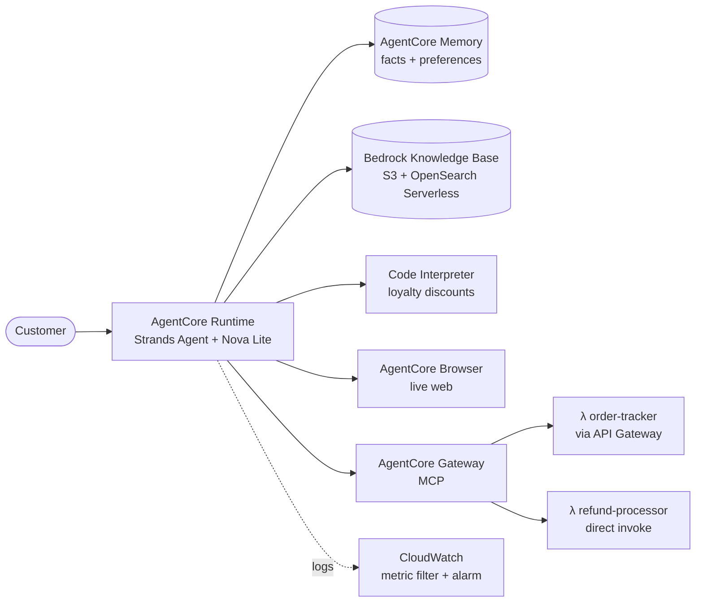

<div align="center">

# 🤖 Production-Grade Customer Support AI Agent

### Built with Amazon Bedrock AgentCore

*Udacity · AWS AI Engineering Nanodegree*


</div>

---

## 📖 Overview

This is a fully functional, production-ready AI customer support agent for a fictional Amazon store. You start with a simple local chatbot and progressively add cloud infrastructure, external tool integration, a knowledge base, persistent memory, a code interpreter and a browser, finishing with a deployable agent that can handle real customer inquiries end to end.

### What the agent can do

| Capability | Powered by |
|---|---|
| 📚 Answer questions about products, return policies and loyalty rewards | RAG with a **Bedrock Knowledge Base** |
| 📦 Look up order status and process refunds | **Lambda** functions via the **AgentCore Gateway** (MCP) |
| 🧠 Remember customer preferences and history across sessions | **AgentCore Memory** (short-term and long-term) |
| 🧮 Calculate exact loyalty discounts securely | **AgentCore Code Interpreter** sandbox |
| 🌐 Navigate websites for live information | **AgentCore Browser** |
| 📈 Monitor and observe behaviour | **Amazon CloudWatch** |

### 🏗 Architecture



---

---

## ✅ Prerequisites

### ☁️ AWS Account

An active AWS account with permission to create and manage:

- IAM roles and policies
- Lambda functions
- API Gateway REST APIs
- Amazon Bedrock Knowledge Bases (with S3 and OpenSearch access)
- Amazon Bedrock AgentCore resources (Runtime, Gateway, Memory)
- Amazon CloudWatch

> [!IMPORTANT]
> Create all resources in **us-east-1** (N. Virginia) unless stated otherwise.

### 💻 Local Development Environment

| Tool | Version |
|------|---------|
| Python | 3.14+ |
| [uv](https://docs.astral.sh/uv/) | Latest |
| AWS CLI | v2 |
| AgentCore CLI (`agentcore`) | Installed via the starter-toolkit |
| Node.js (for MCP Inspector) | 18+ |

### 🔑 Model Access

Enable the following model in the Amazon Bedrock console under **Model access**:

- **Amazon Nova Lite** (`amazon.nova-lite-v1:0`)

---

## 🗂 Project Structure

```
project/
├── INSTRUCTIONS.md          ← this file
├── RUBRIC.md                ← grading criteria
├── starter/
│   ├── main.py              ← your starting point (fill in the TODOs)
│   └── lambda/
│       ├── order_tracker.py     ← provided; deploy as-is
│       └── refund_processor.py  ← provided; deploy as-is
└── solution/                ← reference implementation (do not copy)
    ├── main.py
    ├── product_catalog.txt
    ├── pyproject.toml
    ├── lambda/
    │   ├── order_tracker.py
    │   ├── refund_processor.py
    │   └── lambda_schema       ← JSON schema for Gateway tool registration
    └── step-by-step/           ← one file per build step (for reference)
```

---

## 🚀 Roadmap at a Glance

| Part | Focus | Outcome |
|---|---|---|
| **1** | AWS infrastructure setup | Lambdas, Gateway, Knowledge Base and Memory ready |
| **2** | Building the agent | `main.py` TODOs implemented and agent deployed |
| **3** | Functional testing | 6 scenarios verified |
| **4** | CloudWatch monitoring | Error alarm configured |

---

## ☁️ Part 1 — AWS Infrastructure Setup

> Complete these steps **before** writing any agent code.

### Step 1.1 — Project Initialisation

```bash
# Create a new Python project managed by uv
uv init customer-support-agent
cd customer-support-agent

# Install core dependencies
uv add strands-agents strands-agents-tools
uv add bedrock-agentcore bedrock-agentcore-starter-toolkit
```

### Step 1.2 — Deploy the Lambda Functions

The two Lambda functions (`order_tracker.py` and `refund_processor.py`) are provided in `starter/lambda/`. Deploy them to AWS Lambda before proceeding.

1. In the AWS Lambda console, create two new functions (Python 3.12 runtime):
   - `order-tracker`
   - `refund-processor`
2. Paste the contents of each file into the inline code editor (or zip and upload).
3. Attach an execution role with basic Lambda permissions (CloudWatch Logs).
4. Note the ARN of each function, as you will need them in the next step.

### Step 1.3 — Set Up the AgentCore Gateway

The Gateway exposes your Lambda functions as MCP tools that the agent can call.

1. Open the **Amazon Bedrock** console → **AgentCore** → **Gateways**.
2. Create a new Gateway named `CustomerSupportGateway`.
3. Add two **Lambda targets**:

   | Target Name | Lambda Function | Integration |
   |---|---|---|
   | `order_tracker` | `order-tracker` | API Gateway REST proxy |
   | `refund_processor` | `refund-processor` | Direct Lambda invocation |

4. For `order_tracker`, configure API Gateway routes:
   - `GET /orders/{order_id}`
   - `GET /customers/{customer_id}/orders`
   - `GET /customers/{customer_id}`
5. For `refund_processor`, import the tool schema from `solution/lambda/lambda_schema`.
6. Copy the **Gateway URL** (ends with `/mcp`) and paste it into `GATEWAY_URL` in your `main.py`.

**Verify with MCP Inspector:**

```bash
npx @modelcontextprotocol/inspector
# Connect to your Gateway URL and confirm all tools are listed.
```

### Step 1.4 — Create the Knowledge Base

1. Upload `solution/product_catalog.txt` to an **S3 bucket** in your account.
2. In the Bedrock console → **Knowledge Bases**, create a new Knowledge Base:
   - Name: `CustomerSupportKB`
   - Data source: the S3 bucket from above
   - Embeddings model: Amazon Titan Embeddings v2
   - Vector store: Amazon OpenSearch Serverless (auto-created)
3. **Sync** the data source.
4. Copy the **Knowledge Base ID** and paste it into `KB_ID` in your `main.py`.

**Verify:**

```bash
# In the console, use the Knowledge Base "Test" tab
# Query: "What is the return policy for electronics?"
# Expected: 15-day return window for electronics
```

### Step 1.5 — Create the AgentCore Memory Resource

1. In the Bedrock console → **AgentCore** → **Memory**, create a new Memory resource:
   - Name: `CustomerSupportMemory`
2. Add two **Memory Strategies**:

   | Strategy | Name | Namespace |
   |---|---|---|
   | Semantic extraction | `customer_facts` | `cs_agent/{actorId}/facts` |
   | User preference | `customer_preferences` | `cs_agent/{actorId}/preferences` |

3. Copy the **Memory ID** and paste it into `MEMORY_ID` in your `main.py`.

### 📝 Configuration Values to Collect

| Variable | Where it comes from |
|---|---|
| `GATEWAY_URL` | Step 1.3 (ends with `/mcp`) |
| `KB_ID` | Step 1.4 |
| `MEMORY_ID` | Step 1.5 |

---

## 🛠 Part 2 — Building the Agent

Open `starter/main.py`. It contains scaffolding and `# TODO` comments marking every section you need to implement. Work through the TODOs in order.

> [!TIP]
> The step-by-step reference files in `solution/step-by-step/` show the state of the code after each section is complete. Consult them if you get stuck, but try to implement each section yourself first.

### Section 1 — Configuration and Initialisation

Fill in your resource IDs and set up:

- `BedrockAgentCoreApp`
- `BedrockModel` with Amazon Nova Lite
- `MemoryClient` and `boto3` Bedrock runtime client

### Section 2 — Knowledge Base Tool

Implement `search_knowledge_base(query)`:

- Call the Bedrock Knowledge Base Retrieve API
- Join result chunks with `"\n---\n"`

**Test:**

```bash
agentcore invoke '{"prompt": "Is the Kindle Paperwhite waterproof?"}'
# Expected: mention of IPX8 rating
```

### Section 3 — Long-Term Memory Hook

Implement `MemoryHook` with two methods:

- `retrieve_customer_context`: query all memory namespaces and prepend results to the user message
- `save_support_interaction`: save the completed (user, assistant) turn after each response

### Section 4 — Loyalty Discount Tool (Code Interpreter)

Implement `calculate_loyalty_discount(loyalty_points, tier, order_total, product_category)`:

- Build a Python code string containing the discount logic
- Execute it with `code_session()` and return the JSON result
- Include a fallback for when the Code Interpreter is unavailable

**Test:**

```bash
agentcore invoke '{"prompt": "I am a Gold member with 4250 points. Calculate my discount on a $150 order.", "customer_id": "CUST-123", "session_id": "s1"}'
```

### Section 5 — Main Entrypoint

Implement the `invoke(payload, context)` function:

- Extract `prompt`, `customer_id` and `session_id` from the payload
- Instantiate `MemoryHook` and `AgentCoreBrowser`
- Connect to the Gateway via `MCPClient` and load gateway tools
- Build the `Agent` with all tools and hooks and return its response

### Section 6 — Deploy to AgentCore

```bash
# Configure the AgentCore CLI (first time only)
agentcore configure

# Deploy the agent
agentcore deploy

# Invoke the deployed agent
agentcore invoke '{"prompt": "Hello, what can you help me with?", "customer_id": "CUST-123", "session_id": "test-1"}'
```

---

## 🧪 Part 3 — Functional Testing

Run the following scenarios and verify the expected behaviour. Include screenshots or copy the terminal output in your submission.

| # | Scenario | Expected result |
|---|---|---|
| 1 | 📦 Order tracking | Shipping status, tracking number `TRK987654321`, carrier UPS, estimated delivery |
| 2 | 💸 Refund processing | Refund ID, `APPROVED` status, 3-5 business days message |
| 3 | 📚 Knowledge Base (RAG) | Free same-day shipping, 15% discount, priority support |
| 4 | 🧠 Memory (long-term) | Agent recalls "Jane" and "concise responses" in a new session |
| 5 | 🧮 Loyalty discount | Points redeemed, tier discount 10%, final total, remaining points |
| 6 | 🌐 Browser tool | Page title retrieved from live Amazon.com |

<details>
<summary><b>Test 1 — Order Tracking</b></summary>

```bash
agentcore invoke '{"prompt": "Can you track order ORD-001?", "customer_id": "CUST-123", "session_id": "t1"}'
# Expected: shipping status, tracking number TRK987654321, carrier UPS, estimated delivery
```

</details>

<details>
<summary><b>Test 2 — Refund Processing</b></summary>

```bash
agentcore invoke '{"prompt": "I want to return my Kindle Paperwhite (ORD-002). Please initiate a refund.", "customer_id": "CUST-123", "session_id": "t2"}'
# Expected: refund ID, APPROVED status, 3-5 business days message
```

</details>

<details>
<summary><b>Test 3 — Knowledge Base (RAG)</b></summary>

```bash
agentcore invoke '{"prompt": "What are the benefits of the Platinum loyalty tier?", "customer_id": "CUST-123", "session_id": "t3"}'
# Expected: free same-day shipping, 15% discount, priority support
```

</details>

<details>
<summary><b>Test 4 — Memory (Long-Term)</b></summary>

```bash
# Session A: introduce yourself
agentcore invoke '{"prompt": "Hi, I am Jane. I prefer concise responses.", "customer_id": "CUST-123", "session_id": "s-A"}'

# Session B (new session): verify recall
agentcore invoke '{"prompt": "Do you remember my name and communication preference?", "customer_id": "CUST-123", "session_id": "s-B"}'
# Expected: agent recalls "Jane" and "concise responses"
```

</details>

<details>
<summary><b>Test 5 — Loyalty Discount Calculation</b></summary>

```bash
agentcore invoke '{"prompt": "I am a Gold member with 4250 points. Calculate my discount on a $150 standard order.", "customer_id": "CUST-123", "session_id": "t5"}'
# Expected: points redeemed, tier discount 10%, final total, remaining points
```

</details>

<details>
<summary><b>Test 6 — Browser Tool</b></summary>

```bash
agentcore invoke '{"prompt": "Go to https://www.amazon.com and tell me the page title.", "customer_id": "CUST-123", "session_id": "t6"}'
# Expected: page title retrieved from live Amazon.com
```

</details>

---

## 📈 Part 4 — CloudWatch Monitoring

1. In the AWS console, navigate to **CloudWatch** → **Log Groups**.
2. Find the log group for your AgentCore Runtime (named after your deployment).
3. Create a **metric filter** on `ERROR` log entries.
4. Create a **CloudWatch Alarm** that triggers when the error count exceeds 5 in a 5-minute window.
5. Take a screenshot of the alarm configuration and include it in your submission.

---

## 📬 Submission Checklist

- [ ] `main.py` with all TODOs completed
- [ ] Screenshots or terminal output for all 6 test scenarios
- [ ] Screenshot of the CloudWatch alarm configuration
- [ ] Brief written reflection (200–400 words) covering:
  - One design decision you made and why
  - One challenge you encountered and how you solved it
  - How you would extend this agent for a production environment

---

## 📚 Helpful References

- [Amazon Bedrock AgentCore Documentation](https://docs.aws.amazon.com/bedrock/latest/userguide/agentcore.html)
- [Strands Agents Documentation](https://strandsagents.com)
- [MCP Inspector](https://github.com/modelcontextprotocol/inspector)
- [uv Package Manager](https://docs.astral.sh/uv/)
